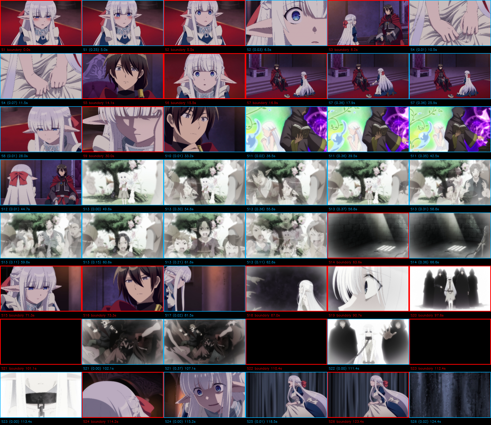
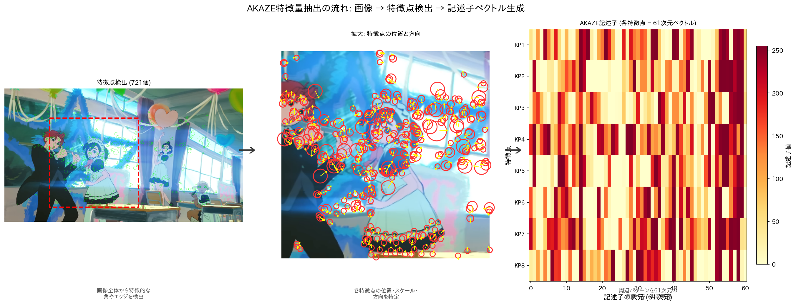
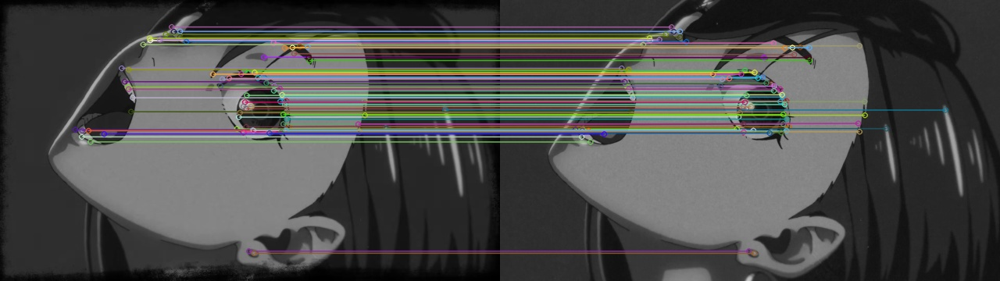
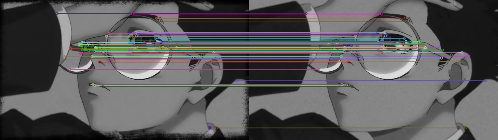
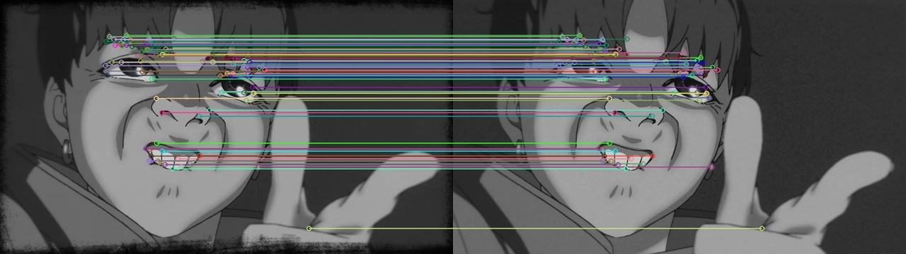
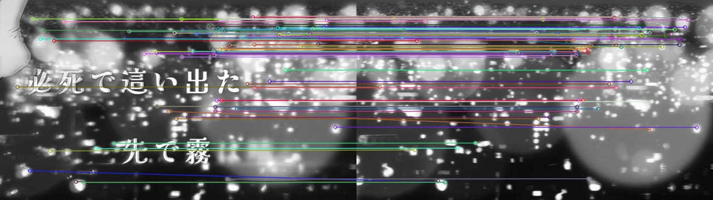

# 映像指紋システム 仕様書

## 1. 概要

映像指紋システムは、映像コンテンツの同一性を判定するためのシステムである。
映像の一部が切り出されたり、PiP（ピクチャー・イン・ピクチャー）として別映像に重畳されたりしても、元の映像を特定できる。

音声指紋（Shazam方式）が「音の周波数パターン」で楽曲を識別するのに対し、映像指紋は「画像の局所的な形状パターン」で映像を識別する。

---

## 2. 動作原理

### 2.1 全体の流れ

```
映像 → フレーム選定 → 特徴量抽出 → 集約・圧縮 → フレーム指紋ベクトル群
         (どのコマを    (各コマの      (各フレームを
          使うか)       視覚的特徴)     1ベクトルに)
```

選定された各フレームが1つの指紋ベクトルになる。1本の映像は複数のフレーム指紋の集合として表現され、検索時はこのフレーム指紋を近傍検索（ANN）の対象とする（詳細は「3. 検索の仕組み」）。

### 2.2 フレーム選定

映像には多数のフレームがある（30fpsなら1分あたり約1,800フレーム）が、全フレームを処理するのは非効率であり、隣接フレームはほぼ同じ画像である。そこで「代表的なフレーム」だけを選び出す。

**シーン変化検出**

映像を時系列に走査し、画面が大きく変化した瞬間（カット、トランジション）を検出する。全フレームではなく約8fps（`scene_eval_fps`）に間引いた評価フレームだけを対象とし、各フレームを160×90に縮小してからシーン検出にかける。

シーン検出には PySceneDetect の `ContentDetector` を用いる。`ContentDetector` はフレームをHSV色空間に変換し、隣接フレーム間のHSV各成分の差分を統合したコンテンツスコアが閾値（`scene_threshold` = 27.0）を超えた時点を「シーン変化」と判定する。自前のデコードループから縮小フレームを逐次 `process_frame()` に渡すため、PySceneDetect側での追加デコードは発生しない。

```
フレームN:   [暗い室内シーン]
フレームN+1: [明るい屋外シーン]  ← 差分が大きい → シーン変化
```

**定期サンプリングと冗長除去**

シーン変化がない区間でも、1秒間隔でフレームを候補として評価する。
ただし、前に採用したフレームと視覚的に同じ（静止画やゆっくりパンするシーン等）場合は冗長として除外する。この判定にはHSVヒストグラムの相関値を使い、相関が0.95以上なら「ほぼ同じ画像」と判断して除外する。

**結果**: 映像の長さに応じて、数百〜千数百フレームを選定する（評価対象は1秒あたり約8フレーム）。

**フレーム選定結果の例**（赤枠: シーン切り替え、水色枠: シーン内のフレーム）:



### 2.3 特徴量抽出（AKAZE）

選定された各フレームから、画像の「特徴的な点」を検出し、その点の周辺パターンを数値化する。

**AKAZEとは**: Accelerated-KAZE の略で、画像中の角（コーナー）やエッジの交差点など、幾何学的に特徴的な点を検出するアルゴリズムである。

**動作原理**:

1. **特徴点検出**: 画像の各位置で「周囲と比べてどれだけ特徴的か」をスコア化する。明確な角やエッジの端点がスコアの高い特徴点として検出される。

2. **記述子生成**: 各特徴点の周囲16×16ピクセル程度の領域のパターンを61次元のバイナリベクトルとして記述する。このベクトルが「この点の周辺はどんな模様か」を表す。

```
1フレームあたり:  約500〜2,000個の特徴点
1特徴点あたり:    61次元の記述子ベクトル
1,000フレームなら: 約100万個の記述子
```

**AKAZE特徴量抽出の流れ**（左: 特徴点検出、中央: 拡大、右: 記述子ベクトル）:



**特徴点の対応例**:

以下は、クエリ映像のフレーム（左）とDB映像の同一シーンのフレーム（右）で、AKAZE記述子が対応付いた特徴点を線で結んだ例である。左右で再エンコード・明るさ・階調・スケールが異なっても、同じ被写体上の特徴点（目・口・眼鏡・輪郭・文字の縁など）が正しく対応している。この対応点の座標がホモグラフィで幾何的に整合するか（インライア数）を数えることで一致を判定する（詳細は「3.2 幾何検証」）。各図の対応線は、後段のRANSACで整合が確認された対応（インライア）を示す。

顔のクローズアップ（対応点 約222点）:



横顔・目のクローズアップ（対応点 約268点）:



顔のクローズアップ・別カット（対応点 約316点）:



文字＋玉ボケの暗いシーン（対応点 約307点）。テクスチャの少ない暗部・ボケ主体のフレームでも、文字の縁や光点の輪郭から特徴点を得て対応付けられる:



**なぜAKAZEを採用したか**: 本システムは「再エンコード・リサイズ・PiPで縮小・明るさ変更された動画クリップ」を元動画と照合することを目的とするため、以下の観点でAKAZEを採用した。

1. **頑健性**: 回転・スケール変化・輝度変化に対して頑健であり、PiPで縮小されたり明るさが変わったりしても同じ特徴点を再検出できる。
2. **非線形拡散スケール空間**: KAZE系はガウシアン平滑化（SIFT等）と異なり非線形拡散でスケール空間を構築するため、エッジや物体境界を保存したまま特徴点を検出できる。再エンコード由来のブロックノイズやぼけがあっても、境界がにじみにくく再現性（repeatability）が高い。
3. **バイナリ記述子（MLDB）で省メモリ・高速照合**: 記述子が61次元のバイナリ（MLDB）であるため、実数記述子（SIFT: 128次元float等）に比べて格納コストが小さく、ハミング距離で高速に比較できる。1,000フレームで約100万記述子という規模でも、コードブック学習・VLAD集約のコストを抑えられる。
4. **ライセンス・可用性**: opencv-contrib に同梱され追加ライセンスの制約なく利用できる（SURF のような特許制約がない）。OpenCV 4.x/5.x のいずれでも利用可能。
5. **精度と速度のバランス**: 同じバイナリ記述子のORBより検出の再現性・記述力が高く、SIFTより軽量という中間的な特性を持ち、フレーム単位で大量に処理する本用途に適する。
6. **GPU不要でCPUのみで動作**: 古典的な画像処理アルゴリズムであり、深層学習ベースの特徴量（ALIKED・DISK・LightGlue等）と異なりGPUや大規模モデルの重みを必要としない。CPUのみの一般的な環境で登録・検索が完結するため、導入・運用のハードルが低い。

### 2.4 VLAD集約

1フレームあたり数百〜数千個の記述子があるが、これを直接比較するのは計算量が膨大になる。VLADは多数の記述子を1つの固定長ベクトルに集約する手法である。

**VLAD（Vector of Locally Aggregated Descriptors）の原理**:

1. **コードブック**: 事前に大量の記述子をK-Means法で64個のクラスタに分類し、各クラスタの中心点（代表パターン）を学習しておく。これが「コードブック」であり、視覚的パターンの「辞書」に相当する（詳細は「5. モデル学習」を参照）。

2. **残差の累積**: 各記述子を最も近いクラスタに割り当て、「記述子 − クラスタ中心」の差分（残差）をクラスタごとに合計する。

```
クラスタ1の残差合計 = Σ(クラスタ1に属する記述子 − 中心1)
クラスタ2の残差合計 = Σ(クラスタ2に属する記述子 − 中心2)
...
クラスタ64の残差合計 = Σ(クラスタ64に属する記述子 − 中心64)
```

3. **結合**: 64個の残差ベクトル（各61次元）を連結して1つのベクトル（64×61 = 3,904次元）にする。

4. **Intra-normalization**: 各クラスタの残差ベクトルを個別にL2正規化する。これにより、特定のクラスタに記述子が偏っている場合のバースト効果（一部パターンが過大評価される現象）を抑制する。

**直感的な理解**: コードブックが「この映像には丸い模様が多い」「直線的なエッジが少ない」といった視覚的特性の分布を捉える。残差は「典型パターンからどれだけずれているか」を表し、映像固有の微妙な違いを保持する。

### 2.5 PCA圧縮

VLADベクトル（3,904次元）は高次元すぎて保存・検索に非効率であるため、PCA（主成分分析）で圧縮する。学習スクリプトのデフォルトは512次元（128/256/512から選択可能）。

**PCAの原理**: 高次元データの分散が最も大きい方向（主成分）を見つけ、その方向に射影する。情報量の多い方向だけを残すことで、次元を大幅に削減しても識別力を維持できる。

```
VLAD 3,904次元 → PCA → 512次元（分散保持率: 約85〜95%）
```

### 2.6 L2正規化

最終的なベクトルをL2正規化（ベクトルの長さを1に統一）する。
これにより、2つのベクトルの類似度をドット積（内積）で高速に計算できる。

```
類似度 = ベクトルA · ベクトルB
完全一致: 1.0、完全不一致: 0.0、逆相関: -1.0
```

### 2.7 フレーム単位指紋

登録時に生成・保存するのは**フレーム単位指紋**である。選定された各フレームについて、AKAZE記述子 → VLAD集約 → PCA圧縮 → L2正規化 の順に処理し、1フレーム=1ベクトルの指紋を得る。指紋の次元数はPCAの設定に依存する（デフォルト512次元）。

| 種別 | 生成方法 | 用途 |
|---|---|---|
| **フレーム単位指紋** | 各フレームのVLAD → PCA → L2正規化 | ANN近傍投票・精密照合・PiP対策 |

各フレーム指紋はベクトル近傍検索（ANN）の対象として保存され、部分クリップ（例: 25分の本編に対する1〜2分のED）でも該当フレームを直接引ける。

---

## 3. 検索の仕組み

### 3.1 フレーム単位ANN投票による候補絞り込み

クエリの各フレーム指紋を直接ベクトル近傍検索（ANN）にかけ、投票で候補映像を絞り込む。音声指紋のhash投票と同じ思想であり、部分クリップでも該当フレームを直接引けるため取りこぼしにくい。

```
クエリ映像の各フレーム指紋
  ↓ 各フレームをANNでKNN近傍検索（バックエンドのベクトル索引）
  ↓ 類似度 sim_threshold 以上の近傍を、その所属映像へ投票
映像別に {得票数(votes), 類似度合計(score_sum)} を集計
  ↓ 得票数を主指標・平均類似度を副指標に上位K件を候補化
候補 Top-K
  ↓ フレーム単位マッチング（精密、候補のみ）
最終結果（一致区間・実効スコア付き）
```

各バックエンドは共通インタフェース `search_frame_candidates(query_fps, dimensions, k_per_query, sim_threshold)` を実装し、`{video_id: {votes, score_sum}}` を返す。

- **votes**: クエリ各フレームの近傍（上位 `k_per_query` 件）に、その映像のフレームが現れた延べ回数（`sim_threshold` 以上のみ採用）。
- **score_sum**: 採用した近傍の類似度合計。平均類似度 = `score_sum / votes`。

### 3.2 幾何検証（RANSAC再ランク）と一致区間

ANN投票で絞り込んだ候補映像に対し、クエリの各フレームとDB側フレームを**AKAZE記述子の幾何検証**で突き合わせて再ランクし、「どの部分が一致しているか」を特定する。VLAD/PCAコサイン類似度は候補の粗い絞り込みに使い、最終判定は幾何的に整合するインライア数で行う。

登録時に生記述子（AKAZE記述子＋キーポイント座標）を保存している場合はこの幾何検証経路を用いる。生記述子が無い場合は、フレーム指紋の類似度から時間オフセットの整列でクラスタを求める経路（`_compute_match_regions`）を用いる。

#### 3.2.1 記述子の幾何検証（`geometric_match`）

1ペア（クエリ1フレーム × DB候補1フレーム）ごとに次を行う（OpenCV標準APIのみを用いた独自実装）。

1. **BF最近傍照合**: AKAZEのバイナリ記述子をHamming距離で総当たり最近傍探索する（`cv2.BFMatcher(NORM_HAMMING).knnMatch(k=2)`）。計算量は O(クエリ記述子数 × DB記述子数) で、ここが最も重い。
2. **Loweの比率検定**: 1位の距離が2位の0.75倍未満のマッチのみ「良マッチ」として採用する。
3. **早期打ち切り**: 良マッチが必要インライア数（`_geom_min_inliers` = 15）に満たない場合は `findHomography` を省いて棄却する。
4. **ホモグラフィ推定**: 良マッチ座標から `cv2.findHomography` でホモグラフィを推定し、再投影誤差 `ransac_thresh`（5.0px）以内の点を幾何インライアとして数える。手法は既定で **USAC_MAGSAC**（頑健で高速）を用い、未対応の古いOpenCVでは通常のRANSACへ自動フォールバックする。
5. **判定**: インライア数が `_geom_min_inliers` 以上のペアのみ「一致」とみなす。真の一致はインライアが数十〜数百、偶発一致は0〜数と桁違いに分離する。

各クエリフレームは類似度上位 `_geom_top_k`（=10）件のDB候補フレームに対して検証し、1フレームで `_geom_max_hits`（=3）件一致した時点で打ち切る。

**BF照合量の抑制**: BF照合はフレームあたり記述子数の二乗で重くなるため、1フレームで突き合わせる記述子を `_geom_max_desc`（=256）件に制限する。真の一致はインライアが桁違いに多く、数百点でも十分に分離できる。

**インライア→スコアの正規化**: インライア数を `_geom_inlier_saturation` で割って[0,1]に飽和させる。飽和点は `0.25 × _geom_max_desc` として記述子上限に連動させ、`_geom_max_desc` を変えてもスコアの尺度が安定するようにする。

#### 3.2.2 検証するクエリフレームの選別（シーン境界優先の間引き）

幾何検証の総BF照合回数は「検証するクエリフレーム数 × 候補数」に比例するため、クエリの全フレームではなく最大 `_geom_max_query_frames`（=128）件だけを検証対象に選ぶ（0以下で無効＝全フレーム検証）。

選別は**シーン境界を優先する方式**（`_select_geom_indices`）を用いる。短い一致断片（数フレームの塊）を密に拾えるよう、次の手順でフレームを選ぶ:

1. 隣接フレームの時間差から**シーン境界を推定**する。ギャップが「中央値ギャップ × `_geom_scene_gap_factor`（=1.8）」を超えた位置を新しいシーン（別カット）の先頭とみなす（`_scene_groups`）。
2. 各シーンの**代表（先頭）フレームを必ず残す**。これにより別カットを最低1枚は検証することを保証する。
3. 残りの予算をシーン内フレーム数に比例して均等配分する。短いシーンの隣接フレームを丸ごと残しやすくなる。

シーン数が予算を超える場合は代表フレームを一様に間引いて上限に収める。

#### 3.2.3 DB時刻クラスタリングによる一致区間（`_compute_geometric_regions`）

幾何検証を通過したペアは「同一画」である。OP（オープニング）は似たカットが多く、クエリ各フレームが同一OP内の別カットに一致するため時間オフセット（DB時刻 − クエリ時刻）はフレーム毎にばらつく。一方、一致先のDB時刻はOP区間（例 340〜427s）に集中する。

そこで検証済みペアのDB時刻を集め、**DB時刻が近いもの同士**（間隔 `_geom_region_db_gap`（=45s）以内）を1つのクラスタに束ね、相異なるクエリフレームが3件以上あるクラスタを「一致区間」として認定する。各区間のクエリ側スパンは、その区間に入った一致フレームのクエリ時刻の最小〜最大で表す。一致区間が1つもない映像は検索結果から除外する。

多重度を保つため、DB時刻の重複や同一クエリフレームの複数候補も潰さずに集計し、区間サイズは相異なるクエリフレーム数で数える（同一クエリフレームの複数候補は1件と数える）。

**候補ごとの並列化**: 生記述子の読み込み（DB I/O）は直列で先に済ませ、CPU律速のBF照合/RANSAC（GILを解放するC++処理）だけを候補ごとにスレッドプールで並列実行する（`_geom_max_workers`、0以下でCPU数）。DBの映像数が増えても検索時間を一定に保ちたい場合は、ANN得票上位 `_geom_max_candidates` 件だけを幾何検証するよう制限できる（0以下で無制限）。

### 3.3 実効映像スコア（被覆率・得票率の反映）

最良フレームのピーク類似度だけを映像スコアにすると、ごく僅かなフレームが偶発的に高一致した候補（例: 84フレーム中4フレームのみ一致）が過大評価される。そこで、クエリのどれだけが一致したかを表す被覆率とANN投票の得票率を反映した**実効映像スコア**をランキング・統合に用いる（`mimizam._effective_video_score`）。表示用の「フレーム指紋」ピーク類似度はこれとは別に表示する。

```
被覆率(coverage)   = 一致フレーム数 / 総クエリフレーム数
得票率(vote_ratio) = min(1, 得票数 / 総クエリフレーム数)
strength = 0.5 × 被覆率 + 0.5 × 得票率
実効映像スコア = ピーク類似度 × (floor + (1 − floor) × strength)    (floor = 0.2)
```

floor=0.2 は、被覆・得票が乏しくてもピーク類似度の2割は残す下限。これにより薄い偶発一致（少数フレームのみの高一致）が確実に降格する。

---

## 4. PiP（ピクチャー・イン・ピクチャー）対策

### 4.1 問題

PiP映像では、画面の一部（例: 25%の小窓）に元映像が表示され、残りは別の映像や単色背景である。小窓外の背景がフレームの大部分を占めるため、フレーム全体をそのまま指紋化すると元映像との類似度が低下する。

### 4.2 解決策

**PiP矩形検出**:

複数フレームの画素値の時間分散（各画素が時間方向にどれだけ変化するか）を計算する。PiP小窓内と背景では動きのパターンが異なるため、分散マップに明確な矩形領域が現れる。

2つの検出手法を併用する:
- **プロジェクション方式**: 分散マップの水平・垂直方向の平均プロファイルから急変点を検出し、矩形の境界を特定する。
- **2D連結成分解析**: 分散マップを複数の閾値で二値化し、連結成分のバウンディングボックスを矩形候補とする。

偽陽性フィルタとして、矩形内外の分散パターン差・境界の不連続性・フレーム間差分の差異を総合スコア化し、0.5以上をPiP矩形として認定する。

**矩形内指紋生成**:

検出された矩形領域を切り出し、長辺1280pxにアップスケールしてからAKAZE記述子を抽出する。アップスケールにより、縮小された映像でもDB側のフレーム指紋（フルサイズで生成）と同等の特徴量が得られる。

### 4.3 フレーム単位マッチングによるPiP対策

PiP矩形検出が不要な場合でも、フレーム単位ANN投票はPiPに対して頑健である。PiP小窓内のフレームにもDB側と一致する特徴点が含まれており、そのフレームがANNで直接引けるため、少数のフレームでも元映像へ投票される。

---

## 5. モデル学習

### 5.1 学習の必要性

VLAD集約にはコードブック（64個の代表パターン）が、PCA圧縮には主成分行列が必要である。これらは実世界の視覚パターンの分布に適合させるために事前学習が必要。

コードブックが適切でないと、VLAD集約の品質が低下する。例えば、学習データが偏っていると、特定の視覚パターンを捉えられず、異なる映像の指紋が似通ってしまう。

### 5.2 コードブック学習の詳細

コードブックはAKAZE記述子の「代表パターン辞書」であり、VLAD集約の品質を決定する最も重要な要素である。

**学習データの収集**:

以下の2つの公開データセットを学習データとして使用する:

- **COCO（Common Objects in Context）**: Microsoftが公開する大規模画像データセット。日常的なシーン（人物、動物、乗り物、室内等）を多様に含み、実世界の視覚パターンを広くカバーする。train2017（約118,000枚）またはval2017（5,000枚）を使用。
- **UCF-101**: セントラルフロリダ大学が公開する動画認識データセット。101カテゴリ（スポーツ、楽器演奏、日常動作等）の約13,000本の動画を含む。静止画（COCO）では得られない動画特有のパターン（モーションブラー、フレーム間変化）を補完する。

これらのデータセットから各画像・動画フレームのAKAZE記述子を抽出する。画像あたり最大500個の記述子をサンプリングし、典型的な学習データ量は数十万〜数百万個の61次元記述子となる。

**なぜ汎用データセットで学習するか**:

コードブックは「視覚パターンの辞書」であり、特定のジャンルに特化する必要はない。COCOとUCF-101の多様な画像・動画で学習することで、エッジ・角・テクスチャ等の基本的な視覚パターンを網羅的にカバーでき、アニメ・実写・スポーツ等あらゆるジャンルの映像に対して安定した指紋を生成できる。

**K-Means法によるクラスタリング**:

収集した全記述子をK-Means法で64個のクラスタに分類する。K-Meansは以下を繰り返す反復アルゴリズムである:

1. 初期中心点を配置（K-Means++法で均等に分散）
2. 各記述子を最も近い中心点のクラスタに割り当て
3. 各クラスタの中心点を、所属する記述子の平均に更新
4. 収束するまで2-3を繰り返し

大規模データに対してはMiniBatchKMeansを使用する。通常のK-Meansは全データを一度にメモリに保持して反復するが、MiniBatchKMeansはランダムなミニバッチ（10,000個）ずつ処理するため、数百万個の記述子でもメモリ効率よく学習できる。

```
入力: COCO + UCF-101 から抽出した数百万個の61次元記述子
    ↓ MiniBatchKMeans (k=64, batch_size=10000)
出力: 64個の61次元中心ベクトル = コードブック

各中心ベクトルが「視覚パターンの代表」を表す:
  中心1: 水平方向のエッジパターン
  中心2: 角のパターン（直角に近い）
  中心3: 緩やかな曲線パターン
  ...
  中心64: テクスチャの少ない平坦領域
```

**なぜ64クラスタか**:

クラスタ数は識別力とベクトルサイズのトレードオフである。クラスタ数を増やすと各クラスタがより細かいパターンを表現でき識別力が上がるが、VLADベクトルの次元数も増える（k×61次元）。64は実験的に十分な識別力とPCA圧縮効率のバランスが取れる値である。

| クラスタ数 | VLAD次元 | PCA前の情報量 | 検索精度 |
|---|---|---|---|
| 32 | 1,952 | やや不足 | やや低い |
| 64 | 3,904 | 十分 | 良好 |
| 128 | 7,808 | 冗長な成分が増加 | ほぼ同等 |

**Codebook Collapse（クラスタ崩壊）対策**:

K-Meansは初期値や記述子の分布によっては、一部のクラスタに記述子が集中し、他のクラスタが空になる「崩壊」が起きることがある。空クラスタがあるとVLADの該当次元が常にゼロとなり、識別力が失われる。

対策として3つの仕組みを設けている:

1. **K-Means++初期化**: 初期中心点を互いに離れた位置に配置し、偏りを防ぐ
2. **再配置率（reassignment_ratio）**: 学習中に空クラスタを検出した場合、最大クラスタの記述子を再配置する
3. **学習後の修復**: それでも空クラスタが残った場合、最大クラスタの中心を分散方向に±0.5σずらして2つに分割し、空クラスタを埋める

```
崩壊検出の例:
  クラスタ割り当て: [0, 0, 0, ..., 250000, ..., 0, 0]
                     ↑空      ↑記述子の90%が集中   ↑空

修復後:
  クラスタ割り当て: [1500, 2000, 1800, ..., 3000, ..., 1700, 1900]
                     ↑均等に分散
```

**コードブックの直感的な意味**:

64個のクラスタ中心は、画像中に出現する「典型的な局所パターン」のカタログである。ある映像フレームの特徴量をコードブックで量子化すると、「このフレームにはパターン3が多く、パターン15が少ない」といった分布が得られる。VLADの残差はさらに「パターン3に近いが、少し右上方向にずれている」といった微細な差異を保持する。

異なる映像は異なるパターン分布と残差を持つため、VLADベクトルが映像の「視覚的指紋」として機能する。

### 5.3 PCA学習の詳細

PCA（主成分分析）はVLADベクトルの次元削減に使用する。

**学習データ**: 全フレームのVLADベクトル（各3,904次元）を行列として並べ、分散が最大になる方向（主成分）を128個抽出する。

**PCAの動作**:

1. 全VLADベクトルの平均を計算 → `pca_mean`（3,904次元）
2. 平均を引いた共分散行列を計算
3. 固有値分解で分散の大きい方向128個を抽出 → `pca_components`（128×3,904行列）

推論時は `(VLADベクトル - pca_mean) × pca_components^T` で圧縮する。

**分散保持率**: 3,904次元から128次元に圧縮しても、元データの分散の85〜95%が保持される。これは、VLADベクトルの多くの次元が相関を持っており（例: 隣接クラスタの残差は似た傾向を示す）、少数の主成分で大部分の情報を表現できるためである。

### 5.4 学習手順のまとめ

```
COCO画像（最大50,000枚） + UCF-101動画（最大2,000本）
  ↓ AKAZE記述子抽出（画像あたり最大500個）
数百万個の61次元記述子
  ↓ MiniBatchKMeans (k=64, batch_size=10000)
64個の61次元中心ベクトル = コードブック
  ↓ 全画像/フレームのVLADベクトル生成
数万個の3,904次元ベクトル
  ↓ PCA学習 (512次元)
512×3,904の主成分行列 + 3,904次元の平均ベクトル
  ↓ 保存
モデルファイル（.npz）
```

学習スクリプトは `scripts/train_pretrained_model.py` であり、`--coco-dir` と `--ucf-dir` でデータセットのパスを指定する。

### 5.5 モデル保存形式

numpy配列のみを保存する形式（format_version=2）を使用し、sklearnのバージョンに依存しない。

```
保存内容:
  codebook_centers:  (64, 61) のnumpy配列  ← K-Meansクラスタ中心
  pca_components:    (N, 3904) のnumpy配列  ← PCA主成分行列（N=PCA次元数、デフォルト512）
  pca_mean:          (3904,) のnumpy配列     ← PCA用平均ベクトル
  descriptor_dim:    61                       ← AKAZE記述子の次元数
  config_dict:       設定パラメータ
```

---

## 6. データベース構造

### 6.1 テーブル構成

| テーブル | 内容 | サイズ目安 |
|---|---|---|
| `videos` | 映像メタデータ（ID, タイトル, パス, 長さ） | 映像数 × 数百B |
| `frame_fingerprints` | フレーム単位指紋（N次元 × フレーム数、ANN索引対象） | 映像数 × 数MB |
| `frame_descriptors` | AKAZE生記述子（再学習用、オプション） | 映像数 × 数十MB |

### 6.2 対応バックエンドとフレームANN

フレーム単位指紋の近傍検索（`search_frame_candidates`）は全バックエンドで同一の結果形式（`{video_id: {votes, score_sum}}`）を返す。sqlite-vec / pgvector / Elasticsearch `dense_vector` / MariaDB の各バックエンドはネイティブなベクトルANN索引を用いる。MySQL はネイティブANN索引を持たないため全フレーム総当たり（brute-force）で同一形式の結果を返す。

| バックエンド | フレームANNの実現方式 | 備考 |
|---|---|---|
| **SQLite** | sqlite-vec 拡張によるANN | ローカル・既定バックエンド。sqlite-vec はコア必須依存 |
| **PostgreSQL** | pgvector の HNSW（cosine、`<=>`） | ネイティブANN。映像指紋には pgvector 拡張が必須（未導入時はエラー） |
| **Elasticsearch** | `dense_vector`（cosine、kNN/msearch） | ネイティブANN |
| **MariaDB** | 11.7+ の `VECTOR(N)` + `VECTOR INDEX (DISTANCE=cosine, HNSW)` + `VEC_DISTANCE_COSINE` | ネイティブANN（コミュニティ版で利用可、MySQLバックエンドを継承） |
| **MySQL** | ネイティブANN索引なし → brute-force 総当たり | 小〜中規模向け。大規模では低速 |

---

## 7. パラメータ一覧

| パラメータ | デフォルト値 | 説明 |
|---|---|---|
| `scene_threshold` | 27.0 | シーン変化検出の閾値。PySceneDetect `ContentDetector` にそのまま渡す |
| `scene_eval_fps` | 8.0 | シーン検出・フレーム評価を行うfps（全フレームは処理しない） |
| `sample_interval` | 1.0秒 | シーン変化がない区間での定期サンプリング採用の間隔 |
| `redundancy_threshold` | 0.95 (HSV相関) | 冗長フレーム除外の閾値 |
| `normalize_long_side` | 1280px | フレーム正規化の長辺サイズ |
| `codebook_size` | 64 | K-Meansクラスタ数 |
| `pca_dimensions` | 512 | PCA圧縮後の次元数（128/256/512から選択） |
| `similarity_threshold` | 0.5 | 検索の最低類似度 |
| `offset_tolerance` | 5.0秒 | 一致区間判定のオフセット許容範囲 |
| `min_region_frames` | 3 | 一致区間として認定する最小フレーム数 |
| `k_per_query` | 10 | ANN投票でクエリ1フレームあたりに引く近傍数 |
| `sim_threshold` | 0.4 | ANN近傍を得票として採用する最低類似度 |
| 実効スコア floor | 0.2 | 被覆率・得票率が乏しいときに残すピーク類似度の下限割合 |
| `pip_score_threshold` | 0.5 | PiP矩形として認定する最低スコア |

---

## 8. 処理性能

ある映像（約24分・30fps・フルHD）での実測例:

| 処理段階 | 所要時間 | 備考 |
|---|---|---|
| フレーム選定 | 約60〜70秒 | 17,000フレーム評価 → 約1,000フレーム選定 |
| AKAZE記述子抽出 | 約30〜40秒 | 約100万記述子生成 |
| VLAD + PCA + L2 | 約5秒 | 512次元ベクトル生成 |
| DB保存 | 約1秒 | SQLite |
| **合計（登録）** | **約100〜120秒** | |
| フレームANN候補検索 | 数十ms〜数百ms | ANNバックエンド |
| フレームマッチング | 約2〜5秒 | 候補数件の場合 |
